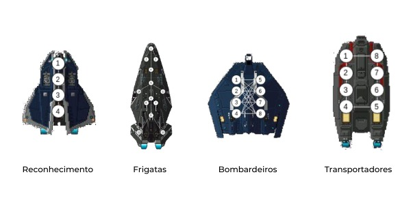

# Spaceships

[](https://svgshare.com/i/Zhy.svg)
[](https://jdk.java.net/)

> ⚠️ Implementação em **java** para o desafio **Spaceships**. Todos os detalhes do problema estão descritos no [**_documento_**](Problema.pdf) de apresentação. A abordagem escolhida e os resultados obtidos estão descritos no [**_relatório_**](Spaceships.pdf) do projeto.

## Overview

Este relatório aborda a implementação do desafio Spaceships. Primeiramente, alguns aspectos gerais sobre o projeto são abordados, assim como as estruturas de dados implementadas e os métodos aplicados na resolução do problema. Em seguida, é feita uma análise da complexidade de cada algoritmo em termos de tempo e espaço. Por fim, o tempo de execução e o consumo de memória são analisados em função do número de vértices, arestas e movimentos para cada tipo de grafo, sendo os resultados expostos por meio de tabelas e gráficos.



## Instalação

Clone o repositório e compile o código utilizando o comando **javac**, de acordo com o exemplo:

```Bash
git clone https://github.com/eduardoatr/Spaceships.git
cd Spaceships
javac -d . spaceships/*.java
```

## Execução

Para executar, basta utilizar o comando **java**, fornecendo como parâmetros o **caminho** para o arquivo contendo a entrada no formato adequado, seguido pelo **caminho** do arquivo de saída, como mostrado no exemplo a seguir:

```Bash
java spaceships.Main "testes/exemplo_1.in" "exemplo_1.out"
```

O arquivo de entrada descreve múltiplas naves de maneira conjunta. A primeira linha da entrada contém dois inteiros **N** (10 ≤ **N** ≤ 10⁵) e **M** (8 ≤ **M** ≤ 10⁶), representando respectivamente o número de postos de combate encontrados pelo radar e a quantidade total de teleportes possíveis entre postos de combate. As próximas **M** linhas possuirão dois inteiros **a** (1 ≤ **a** ≤ **N**) e **b** (1 ≤ **b** ≤ **N**), representando os teleportes possíveis nas naves. Cada posto de combate **a** pode teleportar para **b**, fazendo com que **b** possa também teleportar para **a**. As próximas **N** linhas possuirão dois inteiros **c** (1 ≤ **c** ≤ **N**) e **d** (1 ≤ **d** ≤ **N**), identificando que um tripulante no posto de combate **c** deve retornar a seu posto de combate correto **d**. Caso um tripulante esteja na posição correta, **c** e **d** serão iguais.

Já para o arquivo de saída, a primeira linha deverá ser quatro inteiros **R**, **F**, **B** e **T**, separados por espaço, indicando a quantidade de naves de reconhecimento, frigatas, bombardeiros e naves de transporte, respectivamente. A segunda linha deverá conter um inteiro **V** , representando o tempo de vantagem que sua frota possui.

O diretório **testes** possui exemplos de entradas. Para mais informações, consulte a [**_apresentação_**](Problema.pdf) do desafio e o [**_relatório_**](Spaceships.pdf).
